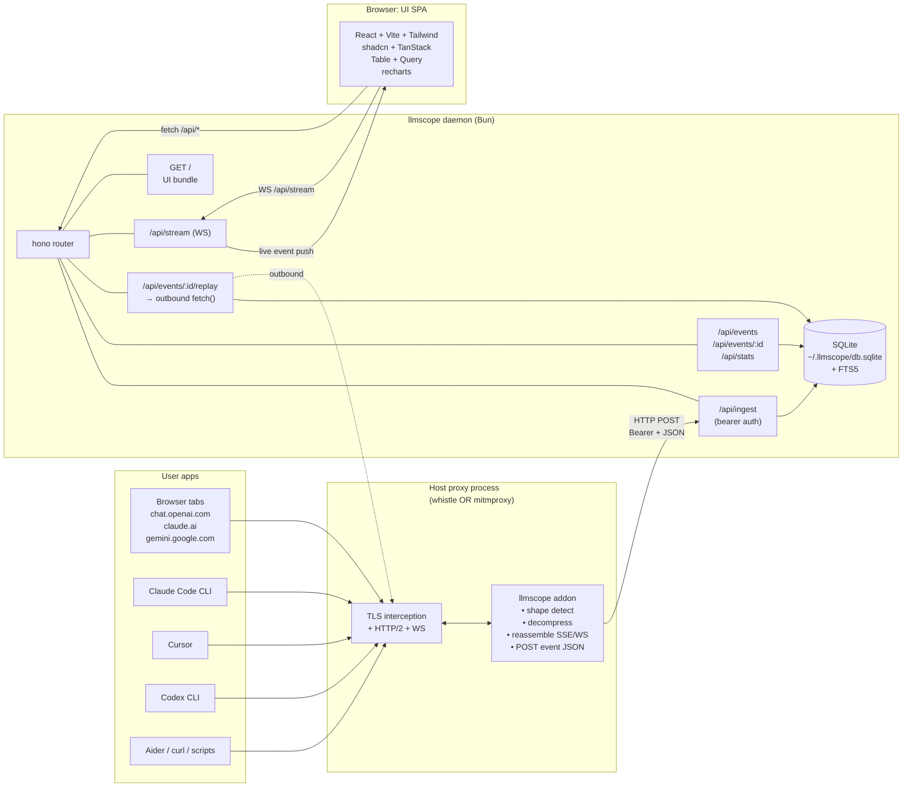
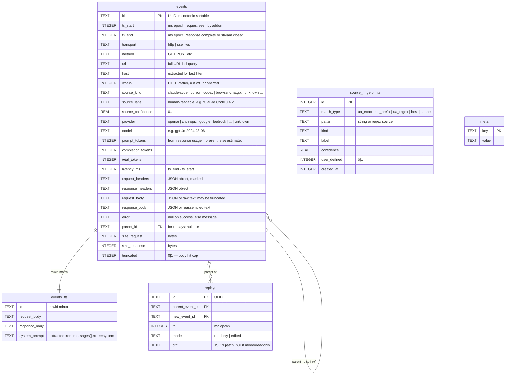

# Architecture: llmscope

> Generated by `/plan` on 2026-04-24
> Status: design locked for v1; addresses PRD at `./prd.md`.

## System Context

### Current State

Nothing exists. New project, empty repo. The relevant lineage from adjacent OSS that informs the design — and that future maintainers should read before reinventing anything:

| Project | Lineage relevance | What we borrow / reject |
|---|---|---|
| **HTTP Toolkit** | Closest UX cousin: local-first interceptor with a slick UI. Closed core + paid tier. | Borrow: localhost dashboard pattern, per-request detail panel. Reject: bundling our own proxy + CA cert install flow. |
| **claude-trace** (badlogic/lemonade-stand) | Single-vendor (Anthropic) `BASE_URL` redirector, JSONL log + simple viewer. | Borrow: minimalist event-log mental model. Reject: env-var redirection — it only catches one provider, one app at a time. |
| **robbyt/llm_proxy** | Go reverse proxy in front of OpenAI; explicit opt-in. | Reject entire pattern: clients must be reconfigured, no transparent multi-app capture. |
| **mitmproxy** | The reference TLS interceptor for Python. We *embed in* it as an addon. | Borrow: the addon model itself. The mitmproxy addon API is the contract we conform to on the Python side. |
| **whistle** | Node-based debugging proxy with first-class plugin system, large CN dev userbase. | Borrow: same plugin-host pattern. v1 primary target. |
| **LiteLLM / Portkey / Helicone** | Server-side routing gateways, often hosted, opt-in via SDK swap. | Reject: wrong shape entirely — these are *gateways*, not *observers*. We use LiteLLM's pricing JSON, nothing else. |

The architectural insight that makes llmscope different from all of the above: **don't be a proxy, be a passenger on the proxy the dev already runs.** Every existing tool either ships its own MITM (CA-cert install hell) or makes the client opt in (so you only see what you remember to redirect). llmscope inverts: the user already trusts whistle/mitmproxy with their TLS, and those proxies already see *everything*. We just teach them to recognize LLM traffic.

### Target State

A six-package Bun workspace monorepo. One long-running daemon process, one short-lived CLI, one SPA, two addons (each runs inside its host proxy's process), one shared core lib. Process model:

```
┌──────────────────────────────────────────────────────────────────┐
│  User's machine                                                  │
│                                                                  │
│  ┌────────────┐                  ┌─────────────────────────────┐ │
│  │ User apps  │─── HTTP/HTTPS ──▶│ Host proxy process          │ │
│  │ (browser,  │   (existing      │ (whistle OR mitmproxy)      │ │
│  │  Claude    │    proxy         │                             │ │
│  │  Code,     │    config        │  ┌───────────────────────┐  │ │
│  │  Cursor,   │    user          │  │ llmscope addon        │  │ │
│  │  Codex,    │    already       │  │ (TS in whistle,       │  │ │
│  │  Aider,    │    has)          │  │  Python in mitm)      │  │ │
│  │  ...)      │                  │  └─────────┬─────────────┘  │ │
│  └────────────┘                  └────────────┼────────────────┘ │
│                                               │                  │
│                                  POST /api/ingest                │
│                                  (bearer-authed, 127.0.0.1)      │
│                                               │                  │
│                                               ▼                  │
│                                  ┌─────────────────────────────┐ │
│                                  │ llmscope daemon (Bun)       │ │
│                                  │                             │ │
│                                  │  hono HTTP server           │ │
│                                  │  ├ /api/ingest              │ │
│                                  │  ├ /api/events              │ │
│                                  │  ├ /api/stream (WS)         │ │
│                                  │  └ /  (UI bundle)           │ │
│                                  │                             │ │
│                                  │  bun:sqlite ──▶ db.sqlite   │ │
│                                  └─────────────────────────────┘ │
│                                               ▲                  │
│                                               │                  │
│                                  ┌────────────┴────────────────┐ │
│                                  │ Browser (UI)                │ │
│                                  │ http://127.0.0.1:<port>/    │ │
│                                  └─────────────────────────────┘ │
└──────────────────────────────────────────────────────────────────┘
```

Six packages:

| Package | Runtime | Role |
|---|---|---|
| `@llmscope/cli` | Bun (TS) | Installer + lifecycle: `init`, `install`, `start`, `stop`, `open`, `status`, `export`. |
| `@llmscope/core` | TS (no runtime) | Shared types, event schema (Zod), provider registry, fingerprint registry, pricing table, SSE/WS reassembly logic exported as pure functions so the whistle addon can reuse them. |
| `@llmscope/daemon` | Bun (TS) | HTTP API + WS + SQLite + UI server. Long-running. |
| `@llmscope/ui` | React/Vite/TS | SPA. Built statically, served by daemon at `/`. |
| `whistle.llmscope` | Bun/Node (TS) | Whistle plugin. Imported into whistle's plugin loader. |
| `llmscope-mitmproxy` | Python 3.11+ | Single self-contained `addon.py`. No pip release for v1; CLI writes it to `~/.llmscope/mitmproxy_addon.py`. |

The daemon is the only persistent process. Everything else is either a passenger in another process (addons) or short-lived (CLI).

## Component Diagram



A few load-bearing notes on the diagram:

- The addon→daemon edge is **HTTP, not stdin/stdout, not Unix socket, not shared memory**. Reason: whistle is Node, mitmproxy is Python, both need a portable transport, and HTTP gives us one debug surface (`curl localhost:<port>/api/ingest`) for both.
- Replays go *back through the same host proxy* if the user has system proxy set, otherwise direct. The daemon respects `HTTPS_PROXY` env. This is intentional — replayed requests should be observable too (they create new events with `parent_id` set).
- The UI never talks to the addon. The addon never talks to the UI. The daemon is the only place data converges. This makes the addon→daemon contract the single integration point.

## Data Model / ERD



### Schema notes

**ID type: ULID stored as TEXT.** Justification: monotonic, sortable, 26-char base32, generated client-side (in the addon, no round-trip to DB), URL-safe in `/api/events/:id`. UUIDv7 would also work and is now standard, but the TS ecosystem support for ULID is more mature and the byte savings vs UUIDv4 are real (26 vs 36 chars × millions of rows). UUIDv7 is the second choice; revisit at v2 if `bun:sqlite` adds a native UUIDv7 generator.

**Why TEXT for bodies, not BLOB.** Bodies are decompressed JSON or text by the time they hit the daemon. SQLite's FTS5 indexes text columns. BLOB would force decode on every read and break FTS. Cost: ~10% storage overhead for UTF-8 vs raw bytes, acceptable.

**Why headers are JSON-encoded TEXT, not separate `headers` table.** Headers are read with the event 100% of the time, joined never. Normalizing them is busywork.

**FTS5 mirror table vs contentless FTS.** We use external-content FTS5 with a trigger to keep `events_fts` in sync. Contentless FTS would save space but require us to re-fetch the source row to display matches, which is fine but adds query complexity. External content + triggers is the standard pattern; pay the 30-50% storage overhead for query simplicity.

**Indexes (created in migration 0001):**

```sql
CREATE INDEX idx_events_ts_start ON events(ts_start DESC);
CREATE INDEX idx_events_source_kind ON events(source_kind, ts_start DESC);
CREATE INDEX idx_events_provider_model ON events(provider, model, ts_start DESC);
CREATE INDEX idx_events_host ON events(host);
CREATE INDEX idx_events_status ON events(status);
CREATE INDEX idx_events_parent ON events(parent_id) WHERE parent_id IS NOT NULL;
```

The `(source_kind, ts_start DESC)` and `(provider, model, ts_start DESC)` composites cover the common filtered-list-view query.

**Body cap.** 5 MB hard cap per body (request or response). Anything larger is truncated to the first 5 MB and `truncated = 1`. The truncation marker `\n\n…[llmscope: body truncated at 5242880 bytes]\n` is appended. Justification: long Realtime sessions can produce >50 MB of audio-base64 text; without a cap, one chatty session blows out the DB and the FTS index. 5 MB lets us keep the full prompt and a meaningful chunk of response for every realistic chat call.

**No separate `tokens` or `cost` table.** Token counts and cost are derived from `total_tokens × pricing[model]`; pricing is a static JSON. Materializing cost would mean schema migration every time prices change. Compute on read.

**`meta` table contents at v1:** `schema_version`, `created_at`, `daemon_version`, `last_eviction_at`.

## API Contracts

All endpoints rooted at `http://127.0.0.1:<port>`. Default port `4317` (CNCF OTel range, easy to remember; configurable). All `/api/*` endpoints require `Authorization: Bearer <token>` except `/api/health`. The UI loads its token from `/api/_bootstrap` which is gated by an `Origin: http://127.0.0.1:<port>` check (CSRF-safe because the daemon refuses cross-origin).

Bodies are JSON unless noted. Error envelope:

```ts
type ApiError = {
  error: {
    code: 'unauthorized' | 'not_found' | 'invalid' | 'too_large' | 'internal';
    message: string;
    details?: Record<string, unknown>;
  };
};
```

### POST /api/ingest

Addon → daemon. The single most important endpoint.

- **Method**: POST
- **Auth**: `Authorization: Bearer <token>`
- **Headers**: `Content-Type: application/json`, optional `Content-Encoding: gzip` (daemon must accept gzip from the addon).
- **Request body**: A single `IngestEvent` (see [Addon Contract](#addon-contract) for the full schema). Roughly:

```ts
type IngestEvent = {
  schema: 1;                      // contract version
  id: string;                     // ULID, addon-generated
  ts_start: number;               // ms epoch
  ts_end: number;
  transport: 'http' | 'sse' | 'ws';
  method: string;
  url: string;
  status: number;                 // 0 for WS sessions
  request_headers: Record<string, string>;   // already masked by addon
  response_headers: Record<string, string>;
  request_body: string | null;
  response_body: string | null;   // for SSE/WS this is the reassembled text
  error: string | null;
  size_request: number;
  size_response: number;
  truncated: boolean;
  // Hints from the addon. Daemon may override after running its own engine.
  hint?: {
    provider?: string;
    model?: string;
    source_kind?: string;
    source_label?: string;
  };
  // For WS: timeline of frames. Optional.
  ws_timeline?: Array<{
    t: number;                    // ms since ts_start
    dir: 'c2s' | 's2c';
    type: 'text' | 'binary';
    data: string;                 // text, or base64 if binary
  }>;
};
```

- **Response**: `204 No Content` on success.
- **Errors**:
  - `401` if bearer missing/wrong.
  - `400` if body fails Zod schema.
  - `413` if body > 16 MB after gzip decode.
  - `503` if daemon's ingest queue is full (back-pressure; addon must retry from its ring buffer).

The daemon does **not** ack with the persisted ID — the addon already chose the ULID. This makes ingest idempotent: addon retry on transient 5xx is safe because the daemon does `INSERT OR IGNORE` keyed by `id`.

### GET /api/events

List view. Cursor-paginated.

- **Method**: GET
- **Query params**:
  - `cursor` — opaque, `{ ts_start, id }` base64-encoded. Omit for first page.
  - `limit` — default 50, max 500.
  - `q` — full-text search across request/response/system_prompt.
  - `source` — repeatable; e.g. `?source=claude-code&source=cursor`.
  - `provider` — repeatable.
  - `model` — repeatable.
  - `status` — `ok` (2xx), `error` (4xx/5xx), `all`.
  - `since`, `until` — ISO 8601 or ms epoch.
- **Response**:

```ts
type EventListResponse = {
  events: EventSummary[];   // no bodies, just metadata + first 200 chars of request_body
  next_cursor: string | null;
};
type EventSummary = {
  id: string;
  ts_start: number;
  latency_ms: number;
  transport: 'http' | 'sse' | 'ws';
  status: number;
  source: { kind: string; label: string; confidence: number };
  provider: string;
  model: string | null;
  prompt_tokens: number | null;
  completion_tokens: number | null;
  preview: string;          // first ~200 chars of last user message
  has_error: boolean;
};
```

Cursor pagination, not offset, because event volume can be high and `OFFSET` on a 10M-row table is brutal. Cursor format: `base64({ ts_start, id })`, query becomes `WHERE (ts_start, id) < (?, ?) ORDER BY ts_start DESC, id DESC LIMIT ?`.

### GET /api/events/:id

- **Method**: GET
- **Response**: full `Event` including bodies and headers. Returns the `IngestEvent` shape plus daemon-derived fields (`provider`, `model`, `source_*`, `*_tokens`, `latency_ms`).
- **Errors**: `404` if not found.

### POST /api/events/:id/replay

- **Method**: POST
- **Request body** (v1: ignored; v2: optional override):

```ts
type ReplayRequest = {
  // v2 only:
  overrides?: {
    model?: string;
    temperature?: number;
    messages?: unknown[];
    tools?: unknown[];
    headers?: Record<string, string>;
  };
};
```

- **Response**:

```ts
type ReplayResponse = {
  new_event_id: string;
  replay_id: string;
};
```

The daemon does the outbound fetch itself (using the parent event's URL, method, headers minus `Authorization` if it was masked — replays of masked-key events return `409 conflict` with a clear message). The new request is captured by the host proxy on its way out (if the user has system proxy set), creating a *new* event that the daemon stitches as a child via `parent_id` once it sees the matching outbound. If the host proxy is bypassed (no `HTTPS_PROXY` set in daemon env), the daemon synthesizes the new event directly from its own fetch result.

- **Errors**: `404`, `409` if Authorization was masked and not user-supplied, `502` on outbound failure.

### GET /api/stats

- **Method**: GET
- **Query params**:
  - `range` — `today | 7d | 30d | all` (default `7d`).
  - `bucket` — `hour | day` (default `day`).
  - `groupBy` — `provider | source_kind | model` (repeatable).
- **Response**:

```ts
type StatsResponse = {
  range: { from: number; to: number };
  buckets: Array<{
    t: number;            // ms epoch, bucket start
    series: Record<string, {  // keyed by groupBy value
      requests: number;
      prompt_tokens: number;
      completion_tokens: number;
      cost_usd: number;
    }>;
  }>;
  totals: {
    requests: number;
    prompt_tokens: number;
    completion_tokens: number;
    cost_usd: number;
  };
};
```

Cost is computed at query time using `packages/core/src/pricing.json`. Models not in the pricing table contribute 0 to `cost_usd` and are listed separately in `totals.unpriced_models: string[]`.

### POST /api/sources

User-defined fingerprint rule.

- **Method**: POST
- **Request body**:

```ts
type SourceRule = {
  match_type: 'ua_exact' | 'ua_prefix' | 'ua_regex' | 'host' | 'shape';
  pattern: string;             // regex source for shape, otherwise literal/prefix
  kind: string;                // arbitrary
  label: string;
  confidence?: number;         // default 1.0 for user-defined
};
```

- **Response**: `201` + the persisted rule with id.
- **Side effect**: when a rule is added, the daemon **does not** retroactively re-tag old events. Re-tagging is offered as a separate action: `POST /api/sources/:id/apply` walks events created since the rule's `created_at - 7d` and updates `source_*` fields. Justification: cheap rules shouldn't trigger expensive scans by default.

### DELETE /api/sources/:id

- Removes a user-defined rule. Built-in rules cannot be deleted.

### GET /api/sources

- Lists all rules (built-in + user-defined), grouped.

### GET /api/health

- **Method**: GET
- **Auth**: none
- **Response**: `{ ok: true, version: string, uptime_s: number, db_size_bytes: number, events_total: number }`. Used by the CLI's `llmscope status` and as a liveness check.

### WS /api/stream

Server → UI push channel.

- **Auth**: `?token=<bearer>` query param (browsers can't set `Authorization` on WS handshake).
- **Frame format** (server → client, JSON text frames):

```ts
type StreamFrame =
  | { type: 'event'; event: EventSummary }       // new event ingested
  | { type: 'event_update'; id: string; patch: Partial<EventSummary> } // re-tag, replay completion
  | { type: 'stats_invalidate' }                 // tell UI to refetch /api/stats
  | { type: 'hello'; server_version: string; daemon_started_at: number }
  | { type: 'ping' };                            // every 30s
```

Client → server: nothing required, but client may send `{ type: 'pong' }`. Connection drops are handled by UI with exponential backoff (1s → 30s cap).

## Addon Contract

This is the single most important contract in the system. If we get it wrong, every addon implementer pays. The contract is defined in `@llmscope/core` as a Zod schema; both the whistle plugin (TS, imports core directly) and the mitmproxy script (Python, must hand-roll the same shape) emit it.

### Responsibilities of the addon

1. **Detect LLM-shaped requests early.** Before reading bodies — sniff content-type and the first 1KB of the request body. A request is LLM-candidate if:
   - JSON content-type AND first 1KB contains both `"model"` and (`"messages"` OR `"prompt"`); OR
   - URL host matches the static host registry (`api.openai.com`, `api.anthropic.com`, `generativelanguage.googleapis.com`, `bedrock-runtime.*.amazonaws.com`, `api.cohere.ai`, `api.mistral.ai`, `api.together.xyz`, `api.groq.com`, `openrouter.ai`, `api.perplexity.ai`, `api.deepseek.com`, `api.x.ai`, `api2.cursor.sh`).

   Non-candidates are dropped immediately with no further processing. This is the fast path — must be < 1ms per non-LLM request.

2. **Buffer the request body fully** before forwarding (or in parallel — depends on host proxy capability). For whistle this means using `req.getReqBody()` after the body event; for mitmproxy `flow.request.content`.

3. **Buffer the response body** with these rules:
   - **HTTP non-stream**: capture `flow.response.content` after response complete. Decompress (gzip/br/zstd) before storing. Emit one event when response is complete.
   - **HTTP SSE** (response `Content-Type: text/event-stream`): accumulate frames in memory. Emit one event when the stream closes (server FIN, or client abort). The `response_body` stored is the **raw concatenated SSE text** (preserving `data:` framing) so the UI can render the timeline. The addon also computes a reassembled message (see [Streaming Reassembly Strategy](#streaming-reassembly-strategy)) and includes it in `response_body` as a JSON envelope:

     ```json
     { "raw_sse": "data: ...\n\ndata: [DONE]\n\n", "reassembled": { "role": "assistant", "content": "..." } }
     ```

   - **WebSocket**: capture both directions. Build `ws_timeline[]`. Emit one event when the WS closes. `response_body` = a reassembled summary (e.g., for OpenAI Realtime: concatenated assistant audio transcript + tool calls). Raw frames live in `ws_timeline[]`.

4. **Decompress before forwarding.** The daemon does not decompress event-payload bodies. The addon owns this. Reason: each addon already has the host proxy's decompression utilities; centralizing in the daemon means re-implementing brotli/zstd in Bun and Python both, for no benefit.

5. **Mask sensitive headers before forwarding.** Default mask list: `Authorization`, `x-api-key`, `api-key`, `x-goog-api-key`, `cookie`, `set-cookie`, `proxy-authorization`. Mask = replace value with `***masked***` keeping the first 4 and last 4 chars (e.g., `sk-a***masked***Z9X2`) to preserve debuggability without leaking the full secret. Configurable via `~/.llmscope/config.json` `mask_headers: string[]` and `mask_strategy: 'redact' | 'preserve_ends'`.

6. **Body size cap: 5 MB**. Truncate, append marker, set `truncated: true`. Apply per-direction (request and response independently).

7. **Generate the ULID at capture time** (before forwarding). This makes the event id stable across addon retries.

8. **POST to `/api/ingest`** with bearer auth read from `~/.llmscope/token` at addon load time. If POST fails:
   - Push to in-memory ring buffer (default capacity: 1000 events).
   - Retry with exponential backoff (1s → 60s cap) in a background task.
   - On overflow: drop oldest, emit one warning per minute via the host proxy's logger.
   - Never block the user's request on ingest. The user's traffic flows whether or not the daemon is up.

9. **"This isn't LLM, drop it"** — addon decides; daemon is not asked. Reason: keeps the daemon's ingest hot path tight and prevents the daemon from seeing arbitrary user traffic, which is a privacy property worth holding.

10. **Error reporting back to the daemon** — for non-2xx responses or upstream failures the addon still emits an event, with `status` set, `response_body` containing whatever was received, and `error` set to a short message (e.g., `"upstream RST"`, `"TLS handshake failed"`). These show up red in the UI. Addon-internal errors (e.g., "failed to decompress") are emitted as events with `transport: 'http'`, `status: 0`, `error: "addon: brotli decode failed"` — never silently dropped.

### Sample payloads

#### A. OpenAI streaming chat completion (SSE)

```json
{
  "schema": 1,
  "id": "01J8KQ7G0R8W4M9C3VYHEB7TZX",
  "ts_start": 1745532001234,
  "ts_end": 1745532003890,
  "transport": "sse",
  "method": "POST",
  "url": "https://api.openai.com/v1/chat/completions",
  "status": 200,
  "request_headers": {
    "content-type": "application/json",
    "authorization": "Bearer sk-p***masked***fG7K",
    "user-agent": "OpenAI/Codex-CLI/0.4.1 (darwin; arm64)",
    "accept": "text/event-stream"
  },
  "response_headers": {
    "content-type": "text/event-stream",
    "openai-organization": "org-abc123",
    "openai-processing-ms": "2410"
  },
  "request_body": "{\"model\":\"gpt-4o-2024-08-06\",\"stream\":true,\"messages\":[{\"role\":\"system\",\"content\":\"You are Codex, a coding assistant.\"},{\"role\":\"user\",\"content\":\"refactor this file\"}],\"tools\":[...]}",
  "response_body": "{\"raw_sse\":\"data: {\\\"id\\\":\\\"chatcmpl-abc\\\",\\\"choices\\\":[{\\\"delta\\\":{\\\"role\\\":\\\"assistant\\\"}}]}\\n\\ndata: {\\\"choices\\\":[{\\\"delta\\\":{\\\"content\\\":\\\"Sure\\\"}}]}\\n\\ndata: {\\\"choices\\\":[{\\\"delta\\\":{\\\"content\\\":\\\", here\\\"}}]}\\n\\ndata: {\\\"usage\\\":{\\\"prompt_tokens\\\":412,\\\"completion_tokens\\\":89,\\\"total_tokens\\\":501}}\\n\\ndata: [DONE]\\n\\n\",\"reassembled\":{\"role\":\"assistant\",\"content\":\"Sure, here's the refactor...\",\"tool_calls\":[]}}",
  "error": null,
  "size_request": 2048,
  "size_response": 8190,
  "truncated": false,
  "hint": {
    "provider": "openai",
    "model": "gpt-4o-2024-08-06",
    "source_kind": "codex",
    "source_label": "Codex CLI 0.4.1"
  }
}
```

#### B. Anthropic non-streaming messages call

```json
{
  "schema": 1,
  "id": "01J8KQ8M1S0X5N0D4WZIFC8U0Y",
  "ts_start": 1745532010000,
  "ts_end": 1745532012345,
  "transport": "http",
  "method": "POST",
  "url": "https://api.anthropic.com/v1/messages",
  "status": 200,
  "request_headers": {
    "content-type": "application/json",
    "x-api-key": "sk-a***masked***3Q9P",
    "anthropic-version": "2023-06-01",
    "anthropic-beta": "tools-2024-05-16,prompt-caching-2024-07-31",
    "user-agent": "claude-cli/0.4.2 (darwin arm64) node/v22.3.0"
  },
  "response_headers": {
    "content-type": "application/json",
    "anthropic-ratelimit-requests-remaining": "49"
  },
  "request_body": "{\"model\":\"claude-sonnet-4-5\",\"max_tokens\":4096,\"system\":\"You are Claude Code...\",\"messages\":[...],\"tools\":[{\"name\":\"Bash\",...},{\"name\":\"Read\",...}]}",
  "response_body": "{\"id\":\"msg_01...\",\"type\":\"message\",\"role\":\"assistant\",\"content\":[{\"type\":\"text\",\"text\":\"I'll read that file.\"},{\"type\":\"tool_use\",\"id\":\"toolu_01...\",\"name\":\"Read\",\"input\":{\"file_path\":\"/tmp/x\"}}],\"usage\":{\"input_tokens\":1240,\"output_tokens\":67}}",
  "error": null,
  "size_request": 5120,
  "size_response": 612,
  "truncated": false,
  "hint": {
    "provider": "anthropic",
    "model": "claude-sonnet-4-5",
    "source_kind": "claude-code",
    "source_label": "Claude Code 0.4.2"
  }
}
```

#### C. OpenAI Realtime API WebSocket session

```json
{
  "schema": 1,
  "id": "01J8KQ9N2T1Y6O1E5XAJGD9V1Z",
  "ts_start": 1745532100000,
  "ts_end": 1745532240000,
  "transport": "ws",
  "method": "GET",
  "url": "wss://api.openai.com/v1/realtime?model=gpt-4o-realtime-preview-2024-10-01",
  "status": 0,
  "request_headers": {
    "authorization": "Bearer sk-p***masked***fG7K",
    "openai-beta": "realtime=v1",
    "user-agent": "Mozilla/5.0 ..."
  },
  "response_headers": {
    "sec-websocket-protocol": "realtime"
  },
  "request_body": null,
  "response_body": "{\"reassembled\":{\"transcript_user\":\"hey can you debug this\",\"transcript_assistant\":\"sure, what's the error?\",\"tool_calls\":[]}}",
  "error": null,
  "size_request": 0,
  "size_response": 142000,
  "truncated": false,
  "ws_timeline": [
    { "t": 12,    "dir": "c2s", "type": "text", "data": "{\"type\":\"session.update\",\"session\":{\"voice\":\"alloy\"}}" },
    { "t": 89,    "dir": "s2c", "type": "text", "data": "{\"type\":\"session.created\",...}" },
    { "t": 3201,  "dir": "c2s", "type": "text", "data": "{\"type\":\"input_audio_buffer.append\",\"audio\":\"<base64...>\"}" },
    { "t": 4520,  "dir": "s2c", "type": "text", "data": "{\"type\":\"response.audio_transcript.delta\",\"delta\":\"sure\"}" }
  ],
  "hint": {
    "provider": "openai",
    "model": "gpt-4o-realtime-preview-2024-10-01",
    "source_kind": "browser",
    "source_label": "Chrome on macOS"
  }
}
```

For Realtime, audio frames in `ws_timeline[].data` are stored verbatim **including the base64 audio** because that's how the protocol carries them. The 5 MB cap applies to the entire event JSON; in practice a 2-minute Realtime session with audio runs ~3-5 MB so fits, but a 30-min session truncates. Acceptable for v1; Realtime power users can raise the cap in config.

## Source Attribution Engine

Source attribution is the defining feature versus everything else in the space. The engine is deterministic, debuggable, and user-extensible.

### Order of precedence

The daemon evaluates rules top-down on every ingest and writes the first match's `kind`/`label`/`confidence`:

1. **User-defined rule** (`source_fingerprints.user_defined = 1`) — confidence as user specified, default 1.0.
2. **UA exact match** (built-in) — confidence 0.99.
3. **UA prefix match** (built-in) — confidence 0.95.
4. **UA regex match** (built-in) — confidence 0.90.
5. **Endpoint host match** (built-in) — confidence 0.80.
6. **Request-shape fingerprint** (built-in, runs against `request_body` JSON) — confidence 0.70.
7. **Fallback**: `{ kind: 'unknown', label: <UA string truncated to 80 chars>, confidence: 0.0 }`.

When confidences from multiple matchers within the same priority level disagree, the higher-confidence one wins; ties broken by the rule's `id` (lower id = older = wins, so built-ins are stable).

The engine runs once per event at ingest time. Re-tagging happens when the user adds a rule and explicitly applies it; no continuous re-eval.

### Initial built-in fingerprint table

Stored in `packages/core/src/fingerprints.ts`, seeded into `source_fingerprints` on first daemon boot.

| match_type | pattern | kind | label | confidence |
|---|---|---|---|---|
| ua_prefix | `claude-cli/` | `claude-code` | `Claude Code` | 0.99 |
| ua_regex | `^Cursor/` | `cursor` | `Cursor` | 0.99 |
| host | `api2.cursor.sh` | `cursor` | `Cursor (cursor.sh API)` | 0.95 |
| ua_prefix | `OpenAI/Codex-CLI` | `codex` | `Codex CLI` | 0.99 |
| ua_prefix | `aider/` | `aider` | `Aider` | 0.95 |
| ua_prefix | `continue/` | `continue` | `Continue.dev` | 0.95 |
| ua_regex | `^Mozilla/.* (Chrome|Safari|Firefox|Edg)/` | `browser` | derived from UA parse | 0.50 |
| host | `chat.openai.com` | `browser-chatgpt` | `ChatGPT web` | 0.99 |
| host | `chatgpt.com` | `browser-chatgpt` | `ChatGPT web` | 0.99 |
| host | `claude.ai` | `browser-claude` | `Claude.ai web` | 0.99 |
| host | `gemini.google.com` | `browser-gemini` | `Gemini web` | 0.99 |
| shape | `messages[0].role=='system' && /You are Claude Code/.test(messages[0].content)` | `claude-code` | `Claude Code (system-prompt match)` | 0.85 |
| shape | `tools[].name in {Bash,Read,Write,Edit,Glob,Grep,WebFetch,TodoWrite}` (>=4 match) | `claude-code` | `Claude Code (tool-set match)` | 0.80 |
| shape | `messages[0].content` starts with `"You are Cursor, an AI coding assistant"` | `cursor` | `Cursor (system-prompt match)` | 0.85 |

For the `browser` row with confidence 0.50, the label is derived by parsing the UA into `{browser, os}` (e.g., `Chrome 130 on macOS`). This row matches every browser request, but the lower confidence means a host-level rule (e.g., `claude.ai`) overrides it correctly via the precedence rules above. We keep it because something is better than `unknown` for unattributed browser hits.

### How users add custom rules

Two paths:

1. **From the UI**: detail view shows the current `source` and a "re-tag" button. Clicking it opens a dialog with three options:
   - "Tag this exact UA as `<x>`" → creates `ua_exact` rule.
   - "Tag any UA starting with `<prefix>` as `<x>`" → creates `ua_prefix` rule (prefix derived from UA).
   - "Tag any request to `<host>` as `<x>`" → creates `host` rule.

   The dialog asks if the user wants to back-apply to existing events.

2. **Via API**: `POST /api/sources` with the `SourceRule` shape.

Rules persist across daemon restarts. Built-in rules are seeded only if the table is empty (first boot); subsequent updates to the built-in table are migrated additively (new rules appended, never overwriting user-defined rules with the same `pattern`).

## Streaming Reassembly Strategy

### Why reassemble on the addon side, not the daemon

Three reasons, in order of weight:

1. **User privacy.** If we forward chunks to the daemon, the daemon ends up with N events to dedupe and stitch. By reassembling in-process, the daemon only ever sees one finalized event per request, which is conceptually clean and means crash recovery for half-streamed events lives in one place (the addon's ring buffer).
2. **Latency.** Streaming chunks over HTTP to localhost is fine, but it doubles the work: the addon parses chunks for reassembly anyway (to compute token counts and `reassembled`), so might as well finish the job before forwarding.
3. **Addon language complexity.** The reassembly logic in `@llmscope/core` is a single function `reassemble({ provider, sse_text }) -> ReassembledMessage`. The whistle plugin imports it directly. The Python addon ports the same logic — finite, well-tested, ~200 LoC per provider.

The cost: an event isn't visible in the UI until the stream closes. For a 30-second SSE call this means a 30-second delay in the dashboard. We accept that for v1; mitigation is the live `/api/stream` push of "in-flight" events as a v2 feature (addon emits a `session_open` ping on stream start, `session_close` on end, daemon shows a "streaming…" placeholder).

### SSE per-provider schemas

The reassembler dispatches on detected provider (from `hint.provider` or, if absent, by sniffing the URL host).

**OpenAI / OpenAI-compatible** (Together, Groq, OpenRouter, Mistral, DeepSeek, etc.):

```
each frame: data: {"id":"...","choices":[{"delta":{"role"?:..., "content"?:..., "tool_calls"?:[...]}}]}
final frame: data: [DONE]
optional usage frame (newer): data: {"usage": {"prompt_tokens":N, ...}}
```

Pseudocode:

```
state = { role: null, content: "", tool_calls: {} /* keyed by index */ }
for each line in sse_text:
    if line starts with "data: ":
        if payload == "[DONE]": break
        json = parse(payload)
        if json.usage: usage = json.usage; continue
        delta = json.choices[0].delta
        if delta.role: state.role = delta.role
        if delta.content: state.content += delta.content
        if delta.tool_calls:
            for tc in delta.tool_calls:
                slot = state.tool_calls[tc.index] ||= { id, name: "", arguments: "" }
                slot.id ||= tc.id
                slot.name += tc.function?.name || ""
                slot.arguments += tc.function?.arguments || ""
return { role: state.role, content: state.content, tool_calls: Object.values(state.tool_calls) }
```

**Anthropic** (Messages API streaming):

```
event: message_start  → data: { message: { id, role, usage: {input_tokens} } }
event: content_block_start → data: { index, content_block: { type: "text"|"tool_use", ... } }
event: content_block_delta → data: { index, delta: { type: "text_delta"|"input_json_delta", text?, partial_json? } }
event: content_block_stop  → data: { index }
event: message_delta → data: { delta: { stop_reason, ... }, usage: { output_tokens } }
event: message_stop
```

Pseudocode:

```
blocks = []  // indexed
usage = { input_tokens: 0, output_tokens: 0 }
for each (event, data) pair:
    switch event:
      case message_start:
        usage.input_tokens = data.message.usage.input_tokens
      case content_block_start:
        blocks[data.index] = { type: data.content_block.type, ...data.content_block, _buf: "" }
      case content_block_delta:
        b = blocks[data.index]
        if data.delta.type == "text_delta": b.text = (b.text||"") + data.delta.text
        if data.delta.type == "input_json_delta": b._buf += data.delta.partial_json
      case content_block_stop:
        b = blocks[data.index]
        if b.type == "tool_use": b.input = JSON.parse(b._buf || "{}"); delete b._buf
      case message_delta:
        usage.output_tokens = data.usage.output_tokens
return { role: "assistant", content: blocks, usage }
```

**Google Gemini** (`streamGenerateContent`):

```
each chunk: a JSON object (not SSE-framed in v1 stream; chunked transfer of NDJSON-ish).
{ candidates: [{ content: { role, parts: [{ text }] } }], usageMetadata: { promptTokenCount, candidatesTokenCount } }
```

Concatenation rule: append `parts[].text` from each chunk's `candidates[0].content.parts[]` into a running text buffer; last chunk usually carries `usageMetadata`.

**AWS Bedrock** (provider-specific within Bedrock; for v1 we recognize the host and treat the body as opaque JSON, no reassembly). Acceptable v1 limitation; events still capture, just `reassembled` is null.

### WebSocket reassembly (OpenAI Realtime)

We don't try to reassemble the audio. We capture the JSON frames as a timeline and extract human-readable bits:

- `transcript_user` ← concat of `{type: "conversation.item.input_audio_transcription.completed"}.transcript`
- `transcript_assistant` ← concat of `{type: "response.audio_transcript.delta"}.delta`
- `tool_calls` ← collect `{type: "response.function_call_arguments.done"}`

Stored in `response_body` as `{ reassembled: { transcript_user, transcript_assistant, tool_calls } }`. Raw frames remain in `ws_timeline[]`.

For non-Realtime WS LLM providers (none widely deployed at time of writing), we still capture the timeline with no reassembly.

## Technology Choices

| Choice | Alternative Considered | Rationale |
|---|---|---|
| **Bun runtime** for daemon/CLI/whistle-addon | Node.js | `bun:sqlite` is built-in (no `better-sqlite3` native build), Bun's HTTP server is faster than Node's, single-binary install. Cost: smaller ecosystem maturity; mitigated by sticking to libraries that work in both. Whistle itself runs on Node, but the plugin module loaded is plain JS so Bun-built output runs fine. |
| **TypeScript** everywhere except mitmproxy | Pure JS, Python everywhere | Shared types in `@llmscope/core` are the contract; TS types compile to Zod schemas for runtime validation. Keeps the type system honest across CLI/daemon/UI/addon. Python is unavoidable for the mitmproxy script (mitmproxy's plugin host is Python). |
| **SQLite via `bun:sqlite`** | DuckDB; JSONL files; PostgreSQL | SQLite is single-file, embedded, has FTS5, has 30-year track record. DuckDB is better for analytics but worse for OLTP-ish ingest patterns. JSONL is too dumb (no indexes, no FTS). PostgreSQL would require running a server, defeating the local-only ergonomic. Cost of SQLite: writer lock means concurrent ingest is serialized — fine at 100 events/sec with WAL mode. |
| **No ORM, no Drizzle** | Drizzle, Prisma, Kysely | Schema is 5 tables and stable. ORM overhead pays off above ~20 tables or ~3 envs. Hand-written SQL with `bun:sqlite` + Zod-validated row shapes is faster to write and faster to run. **If a query builder becomes necessary at v2, pick Kysely** (zero-runtime, type-safe, no codegen). Justifying the override of "if you want a query builder pick one": at v1 we don't want one; at v2 if we do, Kysely. |
| **hono** for the HTTP server | Bun's native `Bun.serve`, Express, Fastify | hono runs on Bun, has middleware ecosystem, has WS support via `@hono/node-ws` or native. Express is Node-only and slower. `Bun.serve` is perfectly capable but routing/middleware has to be hand-rolled. hono is the right level of abstraction. |
| **Zod** for schema | Valibot, ArkType, manual | Zod is the de facto standard, fits with Bun, enables `z.infer` for shared types. Valibot is faster but smaller community. Slight perf penalty acceptable. |
| **React + Vite + Tailwind + shadcn/ui** | Material UI, Mantine, Chakra | shadcn is copy-paste components — owned, modifiable, no runtime dep. Tailwind is universal. MUI is heavy and opinionated. Mantine is good but heavier. shadcn fits a tool that needs a clean dashboard now and will get tweaked frequently. |
| **TanStack Table + TanStack Query** | AG Grid, react-table v7, SWR, Apollo | TanStack Table v8 + Query are the gold standard for headless, server-state-aware data UIs. AG Grid is overkill and pays for features we don't use. |
| **recharts** for charts | visx, Chart.js, victory, plotly | recharts works with React idioms out of the box, is good enough for 4-5 chart types we need. visx is more powerful but more code per chart. We're not building Datadog. |
| **ULID** for IDs | UUIDv7, UUIDv4, snowflake, autoincrement | ULID is sortable, 26-char base32, generated client-side. UUIDv7 is functionally similar and standard but TS ecosystem support is younger. UUIDv4 isn't sortable so requires an index on `ts_start`. Autoincrement requires DB round-trip and is enemy of idempotent ingest. |
| **Bun workspaces** monorepo | npm/pnpm workspaces, separate repos, Nx, Turbo | Bun workspaces are built-in, fast, and the project is small enough that we don't need Turbo's caching. Separate repos would mean syncing the event schema across boundaries every change — exactly what `@llmscope/core` is designed to prevent. |
| **Python 3.11+** for mitmproxy addon | Port to TS via Pyodide/WASM | mitmproxy's addon API is Python-native. Running TS-via-WASM inside mitmproxy adds 50 MB of runtime overhead and a brittle FFI surface to save us from writing 400 LoC of Python. Not worth it. The Python addon is intentionally minimal: HTTP detection, body buffer, decompress, port the SSE/WS reassembly from `@llmscope/core`, POST to daemon. No deps beyond mitmproxy itself + stdlib. |
| **`urllib.request`** in mitmproxy addon for POST to daemon | `httpx`, `requests` | Stdlib, zero install. mitmproxy users already have a working Python env; we don't want to fight their pip state. |
| **No global client store (no Zustand/Redux)** | Zustand, Redux Toolkit | TanStack Query covers all server state. Local UI state (filters, modal open/close) lives in component state or URL search params. No global store needed for v1. If real-time UI complexity grows, revisit at v2. |
| **No ESLint plugin sprawl** | Strict ESLint config | `tsc --noEmit` + `bun fmt` + a minimal `eslint:recommended` is enough. We will not chase a 500-rule config. |
| **WebSocket via Bun native `Bun.serve({ websocket })`** | `ws` library, hono WS plugin | Bun's built-in WS is fastest and integrates with hono via its adapter. |
| **Pricing JSON sourced from LiteLLM at build time** | Hand-curated, runtime fetch | LiteLLM maintains `model_prices_and_context_window.json` and is the community-de-facto source. We snapshot it into `packages/core/src/pricing.json` via a build script. Runtime fetch would require network at daemon start, breaking offline use. |

## Process Model & Lifecycle

### Daemon

- **Started by**: `llmscope start` (CLI) → `bun run packages/daemon/src/main.ts` detached, with stdio redirected to `~/.llmscope/daemon.log`. PID written to `~/.llmscope/daemon.pid`.
- **Supervised by**: nothing. v1 does not install a launchd plist or systemd unit. The CLI's `llmscope start` is idempotent (checks PID file, verifies process is alive, no-op if so). Auto-restart is a v2 problem; rationale: making this a background service introduces install/uninstall complexity (plist files, sudo for systemd) that conflicts with "easy local tool" positioning.
- **Port selection**: read from `~/.llmscope/config.json` `port` (default 4317). On `EADDRINUSE`, daemon refuses to start and logs a clear error; user must change port.
- **Bind**: `127.0.0.1` only. Refuses to bind to `0.0.0.0` even if config says so (hard-coded guard).
- **Schema migrations**: on boot, the daemon reads `meta.schema_version`, then runs migrations 0001..N from `packages/daemon/src/migrations/` until schema_version matches the daemon's compiled-in target. Migrations are forward-only. Down-migrations are not supported (this is a debugging tool, not a production DB).
- **WAL mode**: enabled on first boot via `PRAGMA journal_mode=WAL; PRAGMA synchronous=NORMAL;`. `wal_autocheckpoint` left at default. WAL means readers (UI list view) don't block ingest writers.
- **Eviction**: a background tick runs every 5 minutes. If `db.sqlite` size > `config.max_db_bytes` (default 1 GB), delete oldest events until size < 90% of cap. Eviction is logged and emits a `stats_invalidate` WS frame so the UI refreshes.
- **Graceful shutdown**: SIGTERM/SIGINT → stop accepting new requests, flush pending ingest writes, close WS connections with code 1001 (going away), close DB, remove PID file, exit. Hard timeout 5s; then `process.exit(1)`.
- **Crash recovery**: SQLite WAL handles partial writes. On boot, the daemon checks if PID file exists pointing to a dead process — if so, removes it and proceeds. No event-level crash recovery needed because events are atomic single-row inserts.

### Addon ring buffer (crash recovery for the addon→daemon link)

- Each addon maintains an in-memory ring buffer of pending `IngestEvent`s, default capacity 1000.
- On `POST /api/ingest` 5xx or network failure: push to buffer, retry in background with exponential backoff 1s → 60s.
- On overflow (buffer full): drop oldest, increment `dropped_events` counter, log warning to host proxy log every 60 seconds.
- Buffer is **not persisted to disk**. If the user restarts the host proxy, in-flight events are lost. v1 accepts this; v2 may add a small write-ahead log per addon.
- Daemon-down detection: addon health-pings `GET /api/health` every 30s when there's pending traffic in the buffer; resumes flushing on first 200.

### CLI

- All commands are short-lived processes.
- `llmscope start`: spawn daemon, write PID file, exit 0. Idempotent.
- `llmscope stop`: read PID file, send SIGTERM, wait up to 5s, then SIGKILL. Remove PID file.
- `llmscope status`: read PID file, hit `/api/health`, print human-readable summary.
- `llmscope export --format jsonl --since <date>`: opens DB read-only (separate connection), streams matching events to stdout as JSONL.

### UI

- Static bundle built by `bun run --filter @llmscope/ui build` → output to `packages/daemon/public/`.
- Daemon serves it via hono's `serveStatic`. UI loads `/`, fetches `/api/_bootstrap` (returns config like `{ port, version }` without auth, plus a same-origin-checked token cookie set), then connects to `/api/stream` for live updates.
- Hot reload during development: `bun run --filter @llmscope/ui dev` runs Vite on port 5173 with proxy to daemon at 4317.

## Security Model

### Threat model

llmscope captures plaintext LLM traffic — including system prompts and, in worst-case configurations, API keys. The threat model is therefore **a single-user local development tool, not a multi-tenant service**. We protect against:

- Other apps on the same machine reading captured data via the daemon's API.
- API keys in headers being persisted to disk readable by any process running as the user.
- Cross-site web pages talking to the dashboard via DNS rebinding or CSRF.

We do **not** protect against:

- Root/admin on the same machine. Nothing we do stops a root process from reading `~/.llmscope/`.
- Malicious browser extensions running with full DOM access in the dashboard tab.

### Bearer token

- Generated on first daemon start: 32 bytes from `crypto.getRandomValues`, base64url-encoded → 43-char token.
- Written to `~/.llmscope/token` with mode `0600` (Unix) / equivalent ACL (Windows: deny everyone except current user).
- Daemon reads token on start. CLI reads it for outbound API calls. Addons read it on load.
- Rotation: `llmscope rotate-token` regenerates and writes the file; user must restart host proxy(ies) for addons to pick up the new token.

### Network binding

- Daemon binds **`127.0.0.1` only**. No `0.0.0.0`, no `::`. Hard-coded.
- DNS rebinding defense: daemon checks `Host` header on every request. Allowed hosts: `127.0.0.1:<port>`, `localhost:<port>`. All others 403.
- CORS: `Access-Control-Allow-Origin: http://127.0.0.1:<port>` and `http://localhost:<port>` only. No wildcard. `Access-Control-Allow-Credentials` not set (we don't use cookies for auth — bearer in header, same-origin-checked).

### Header masking on capture

Default behavior: addon masks before forwarding. Daemon trusts the addon. The masked-headers list is **enforced in two places**: addon (best-effort, can't be bypassed for normal users) and daemon (defense-in-depth: re-mask on ingest if any value looks like an unmasked secret per heuristic — long high-entropy string in a header named in the mask list).

User opt-out: `~/.llmscope/config.json` `mask_headers: ["Authorization", "x-api-key", ...]` — user can shorten the list (e.g., remove `Authorization` if they want full keys captured for replay). UI shows a banner when masking is reduced from default.

### Body content

Bodies are **not** masked by default. A v2 feature would scan request bodies for likely secrets (e.g., `sk-` prefixes outside expected fields) and mask them. v1 ships without that — bodies in the LLM context are typically prompts/responses, not secrets.

### CORS and CSRF

- All `/api/*` (except `/api/health`) require bearer `Authorization` header.
- Browsers can't send arbitrary headers on cross-origin requests without CORS preflight.
- WS `/api/stream` accepts the token via query string; daemon checks `Origin` header on the upgrade request and rejects mismatches.
- A malicious page on `evil.com` therefore cannot:
  - Read events (CORS preflight blocks the GET).
  - POST events (token unknown, CORS blocks anyway).
  - Open the WS (Origin check fails).

### Logs

- Daemon logs go to `~/.llmscope/daemon.log` with mode `0600`.
- Logs do **not** include event bodies. They include event IDs, source kinds, and provider/model.
- Errors include stack traces; if a stack trace would include a request body fragment (e.g., parse error), the daemon truncates that fragment to 200 chars.

## Dependencies

### npm packages (locked at design time, version constraints set per package's `package.json`)

| Package | Used by | Purpose |
|---|---|---|
| `hono` | daemon | HTTP routing |
| `zod` | core, daemon, cli, ui | Schema validation |
| `ulid` | core, daemon, addons | ID generation |
| `date-fns` | ui, daemon | Date math (UI), bucket boundaries (stats) |
| `react`, `react-dom` | ui | Obvious |
| `react-router-dom` | ui | Routing |
| `@tanstack/react-table` | ui | Event list table |
| `@tanstack/react-query` | ui | Server-state caching |
| `recharts` | ui | Charts |
| `tailwindcss`, `postcss`, `autoprefixer` | ui | Styling |
| `clsx`, `tailwind-merge`, `class-variance-authority` | ui | shadcn deps |
| `lucide-react` | ui | shadcn icons |
| `@radix-ui/react-*` (whatever shadcn pulls) | ui | shadcn primitives |
| `vite`, `@vitejs/plugin-react` | ui | Build |
| `commander` | cli | Arg parsing |
| `chalk` | cli | Colored output |
| `prompts` | cli | Interactive prompts |
| `eventsource-parser` | core | SSE frame parsing in reassembler |
| `bun-types` | all TS packages | Bun's TypeScript types |

### Python packages

- `mitmproxy` — peer dep, user-supplied (we don't pin a version, we declare ≥10.0).
- **No** `requests`, `httpx`, `aiohttp`. The addon uses `urllib.request` from stdlib for the daemon POST.
- **No** `pydantic`. The addon hand-validates the dict before serialization. Reason: keeps the addon a single self-contained `.py` with zero pip installs.

### Deliberately not pulled in

- **No ORM** (Drizzle, Prisma, Kysely, TypeORM). Schema is small and stable.
- **No styled-components / emotion**. Tailwind only.
- **No Zustand / Redux / Jotai / Valtio**. TanStack Query + URL params + component state.
- **No `better-sqlite3`**. `bun:sqlite` is built-in.
- **No Lodash**. Native methods; `clsx` for class merging.
- **No moment.js**. `date-fns`.
- **No Sentry or telemetry SDK**. Local tool, no outbound. Hard rule.
- **No `axios` / `got` / `node-fetch`**. Daemon uses `fetch` (Bun built-in) for replays.
- **No `express`**. hono.
- **No `winston` / `pino` for daemon**. A 50-line `log.ts` writing JSON lines to `~/.llmscope/daemon.log` is fine.
- **No `dotenv`**. Config lives in `~/.llmscope/config.json`; env vars used sparingly (`LLMSCOPE_PORT`, `LLMSCOPE_HOME`).
- **No `nodemon` / `tsx`**. Bun runs TS natively; `bun --hot` for dev.
- **No CI matrix bloat**. macOS + Ubuntu + Bun-latest. Windows tested manually for v1.

## Risks / Open Architectural Questions

| # | Risk | Severity | Mitigation |
|---|---|---|---|
| **R1** | Whistle's plugin API may not expose WebSocket frames bidirectionally. If true, WS capture on whistle path is impossible without core changes to whistle. | High (kills "OpenAI Realtime in browser" use case on whistle) | Investigate before building: write a 50-line probe plugin that tries to access WS frames. If unsupported, document in README that WS requires mitmproxy for v1. Don't block release. |
| **R2** | `bun:sqlite` FTS5 support. The Bun docs say SQLite is compiled with `SQLITE_ENABLE_FTS5`, but production-grade verification is needed before committing to FTS5. | High (changes search architecture) | First-week task: write a smoke test that `CREATE VIRTUAL TABLE x USING fts5(...)` succeeds in a fresh `bun:sqlite` DB. Bun ships with FTS5 enabled as of 1.1+ — confirm at build. Fallback: ship search via `LIKE '%q%'` with no FTS, slower but functional, until we ship a fix. |
| **R3** | macOS Sequoia (15.x) sandbox restrictions on `~/.llmscope/` writes from the Python mitmproxy process. mitmproxy itself has had file-access problems on recent macOS due to TCC. | Medium | The addon writes nothing to disk — it only POSTs over localhost. The token file is written by the daemon (Bun process), not the addon. Addon reads the token via env var `LLMSCOPE_TOKEN` (CLI sets it when launching mitmproxy via wrapper) instead of file read. Document the wrapper in README. |
| **R4** | Daemon ingest write contention at high event rate. SQLite serializes writers; 100 events/sec is ~10 ms/write budget. With WAL + `synchronous=NORMAL` we expect 1-3 ms/insert, so 100 evt/sec sits well within budget. But a burst of 1000-event spikes (e.g., user replays a stress-test) can exceed it. | Medium | Buffer ingest in a bounded queue inside the daemon, batch-insert in groups of 50. Falls back to single-row if queue idle. Measure on a 16 GB MacBook before declaring acceptable. |
| **R5** | DB growth and FTS5 query latency at large sizes. At 10 GB / ~10 M events, FTS5 queries can degrade from 10 ms to 500+ ms depending on query shape. | Medium | Default eviction cap 1 GB keeps us in the safe zone. Document the trade-off in the eviction config. Optional v2: shard DB by month (`db-2026-04.sqlite`, `db-2026-05.sqlite`) and union-query at the daemon. Don't do it for v1. |
| **R6** | Replay fidelity: replaying an event captured 3 days ago may fail because the API key was masked. | Medium | Daemon detects masked Authorization on replay request; returns 409 with `error.code=replay_requires_auth` and asks the user to provide an auth header in the replay UI. v2 editable replay surfaces this in the form. |
| **R7** | Provider drift: OpenAI/Anthropic change their SSE schemas without warning. Reassembly silently produces wrong content. | Medium | The reassembler always preserves `raw_sse` in `response_body`, so the UI can show the raw stream when reassembly looks empty. Add a self-test on each event: if `reassembled.content` is empty but `raw_sse` is non-trivial, log a warning. |
| **R8** | Source attribution is wrong for users who proxy multiple machines through one whistle/mitmproxy instance. Same UA from two devs would tag identically. | Low | Document the limitation. Out-of-scope for v1 (the PRD scopes to local-only single-user). Multi-source attribution would need network-layer info we deliberately don't collect. |

### Open architectural questions for the user

- **Q1**: Should the daemon expose a Prometheus `/metrics` endpoint for the user's own observability stack? Default lean: **no** for v1; add at v2 if requested.
- **Q2**: Do we want to embed a small embedding model (e.g., `bge-small-en`) for "semantic search across captured prompts" as a v2 feature? If yes, the schema needs an `embedding BLOB` column added now (cheaper to do at v1 schema time than to migrate later). Default lean: **add the column, leave it null**, decide later.
- **Q3**: Should `llmscope export` support encrypted JSONL by default (passphrase-derived AES-GCM)? Captured prompts are sensitive. Default lean: **plain JSONL for v1**, document the sensitivity, add `--encrypt` in v2.
- **Q4**: For pricing snapshot from LiteLLM — pin to a specific commit at build time, or always `latest`? Default lean: **pin to commit**, refresh quarterly via a `bun run refresh-pricing` script.

## Notes

A few things I'm choosing to be opinionated about that the user should explicitly confirm or override:

1. **Default port `4317`.** I picked it because it's in the OTel range and easy to remember; if the user has actual OTel collectors running locally, this collides. A simple `LLMSCOPE_PORT` env var override is in the design. If the user prefers a less-loaded port (`5757`, `7531`, etc.) say so.

2. **5 MB body cap.** Conservative. Realtime audio sessions can blow through this. If the user expects heavy Realtime use, raise to 25 MB and the SQLite size will tolerate it (eviction does the rest).

3. **No persistent addon ring buffer.** If the daemon is down for 10 minutes during a heavy session, events are lost. v1 accept; if the user disagrees, the design extension is straightforward (SQLite or JSONL ring file in the host proxy's work dir).

4. **No service installation (launchd/systemd) for v1.** Daemon is start-on-demand. If the user wants "llmscope is always running silently in the background" as a UX goal, we should add `llmscope service install` to v1 scope.

5. **Replay synthesis path.** The doc above describes two paths: (a) replay goes back through the user's proxy (gets captured, parent-stitched), and (b) replay synthesizes a new event directly. Path (a) is more honest but depends on the daemon process's `HTTPS_PROXY` env. The CLI's `start` command should set `HTTPS_PROXY=http://127.0.0.1:<host_proxy_port>` automatically — or NOT, depending on whether the user wants replays to be traced. **Default lean**: don't auto-set; daemon synthesizes replay events directly. User can opt in via config.

6. **Schema version 1 is locked.** Any new field in `IngestEvent` post-v1 ship requires bumping `schema: 2` and writing a migration in `core/src/ingest-migrate.ts` that converts schema:1 payloads to schema:2 on receipt.

7. **The mitmproxy addon being a single `.py` file is a constraint, not a goal.** If the addon grows past ~800 LoC, split it into a `pip install llmscope-mitmproxy` package. The CLI's installer can handle either path transparently.

8. **No tests are described in this doc.** Test strategy lives in the task list / TDD plan. The architecture is testable: `core` is pure functions, `daemon` is HTTP-in-DB-out, `ui` is component-level. Integration tests are addon→daemon ingest of canned fixture payloads (the three sample payloads in [Sample payloads](#sample-payloads) double as fixtures).
